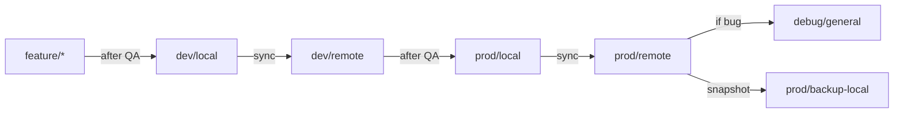

# Git Branch Strategy

This document outlines the Git branching convention and usage for this project.


## 🔄 Branch Overview

| Branch Name        | Purpose                                             |
|--------------------|-----------------------------------------------------|
| `dev/local`        | Feature dev branch used for **local testing** only. |
| `dev/remote`       | Used to stage new features on **remote dev servers** (e.g., EC2 dev). |
| `prod/local`       | Snapshot of production logic for **local debugging** |
| `prod/remote`      | **Deployed production** branch (used by EC2 prod).  |
| `debug/general`    | Misc testing, hotfixes, and experiments             |
| `prod/backup-*`    | Backup branches for rollbacks or snapshots          |
| `feature/*`        | Feature specific development.                       |

---

## 🧬 Branch Flow



## 👇 Guidelines
- dev/* branches are for iterative development. Push feature commits and test.
- prod/remote is the only branch directly used in deployment (docker-compose pull on EC2).
- Never commit secrets or config overrides to tracked files. Use .env, .secrets, or AWS Secrets Manager.
- Tag releases (e.g., v1.2.0) on prod/remote for version traceability.

## 🧹 Cleanup Policy
- Clean up stale debug/* branches regularly.
- Use prod/backup-* sparingly to avoid clutter.

## ✅ Local Setup Tips
```
git checkout dev/local
git pull origin dev/local

# work on feature
git checkout -b feature/feature-desc origin/dev/remote

# merge changes to dev/remote for testing
git checkout dev/remote
git merge dev/local-my-feature
git push origin dev/remote
```


## 🔧 Git Branch-Based Workflow for Future Lab Project Development
### 1. Set Up Local Environment
- Clone the main repository:
  ```bash
  git clone https://github.com/your-org/your-repo.git
  cd your-repo
  ```

- Ensure you’re on the latest version of the main branch:
  ```bash
  git checkout main
  git pull origin main
  ```

### 2. Create a New Feature or Fix Branch
 - Use consistent branch naming:
   - feature/short-description – for new features
   - fix/short-description – for bug fixes
   - Include ticket or task ID if available: feature/1234-data-cleanup
 - Example:
      ```bash
      git checkout -b feature/add-api-endpoint
      ```
### 3. Develop Your Changes
 - Make regular commits with meaningful messages:
      ```
      git add .
      git commit -m "Implement API endpoint for heart rate data"
      ```
 - Keep each branch focused on a single feature or task.

### 4. Sync Regularly with main
- To prevent merge conflicts:
  ```
  git checkout main
  git pull origin main
  git checkout feature/your-branch
  git merge main   # or use git rebase main
  ```
- Resolve any conflicts early.

### 5. Pre-Pull Request Checklist
 - Run all relevant tests and linters locally.
 - Double-check that the branch is up to date with main.
 - Review your code for clarity, documentation, and style.

### 6. Push and Open Pull Request
 - Push your feature branch:
  ```
  git push origin feature/your-branch
  ```
 - Create a Pull Request (PR) to merge into main (or dev, if multi-env):
    - Provide a clear description of changes.
    - Link related issues or tasks.
    - Add reviewers.

### 7. Review and Merge
 - Respond to reviewer feedback.
 - If the PR becomes outdated, rebase or merge from main again.
 - Once approved, merge the PR using:
 - Squash merge (recommended) for a clean, single-commit history.
 - Or regular merge for preserving commit history if needed.

### 8. Post-Merge Cleanup
 - Delete the branch locally:
   ```
   git branch -d feature/your-branch
   ```
 - Delete it remotely:
   ```
   git push origin --delete feature/your-branch
   ```

### 9. (Optional) Multi-Environment Branching (if applicable)
 - If the project uses environments like dev, staging, and main:
   - PRs merge into dev first.
   - Promote dev ➜ staging ➜ main in sequence after QA checks.
 - Tag production releases:
   ```
   git tag -a v1.0.0 -m "First stable release"
   git push origin v1.0.0
   ```

### 10. Notes
 - Always pull the latest changes before starting new work.
 - Avoid large PRs — smaller, focused changes are easier to review and test.
 - Write clear, concise commit messages and PR descriptions.
 - For experimental ideas, use temporary experiment/* branches and never merge them directly into main.